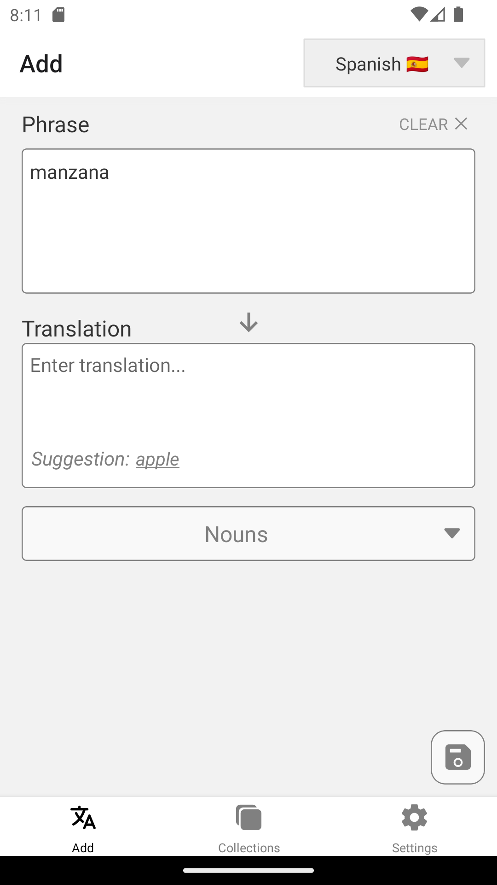
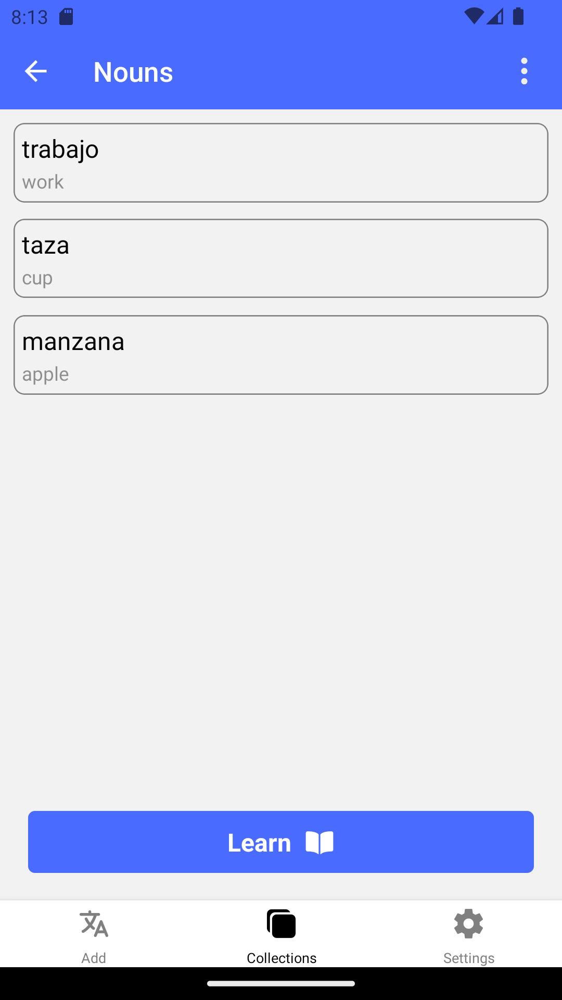
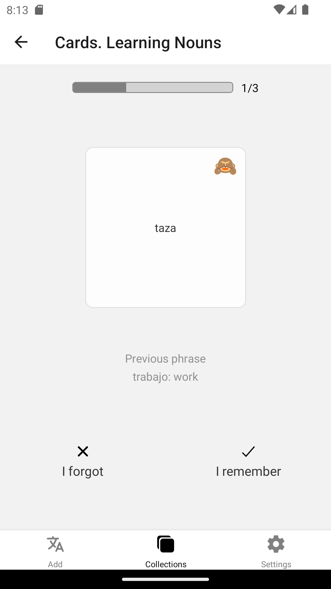
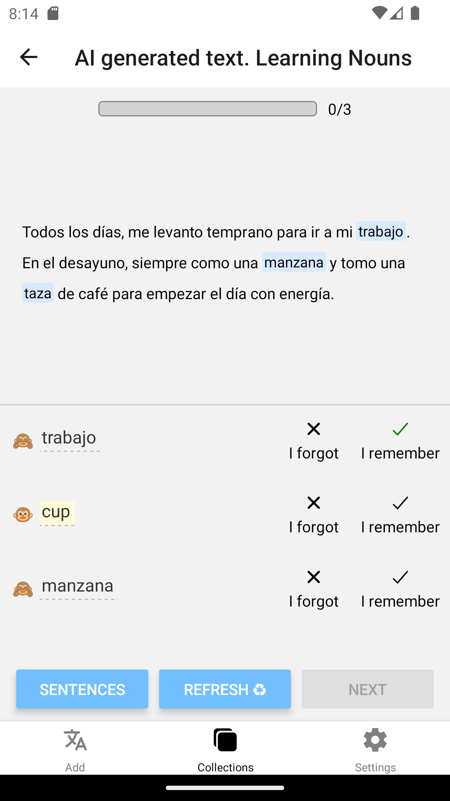

# Vocabulary
## :uk: English
__Description:__ Mobile app for improving vocabulary

__Used technologies:__

- Typescript
- React Native / Expo
- React Native navigation
- React hooks
- GraphQL / Apollo client
- MobX
- Moment
- Node.js / Express
- JWT auth
- MongoDB

__About project:__ Vocabulary - is an app for building vocabulary. It let you store and manage your saved phrases in a convenient way, instead of writing them down on paper. It provides various ways to learn saved phrases, including classic flip cards, automatically created interval collection or text generated by AI for learning phrases in context. The app uses email as a login, and provides full set of account management functionality like changing or resetting password, logging in on multiple devices e.t.c. The app is based on React Native, therefore is natively crossplatform. Frontend part uses GraphQL for communication with server (on which it's strongly dependent). Inner state of the app is stored in MobX and Apollo hooks (for data loaded from server). Backend part relies on side apis like bing translator (for offering suggestions) or open AI api. All permanent data stored in MongoDB.

P.s. Being passionate language learner myself, I tried to make this app as useful as possible based on my own experience. It was made to help with overcoming the obstacles that I, and other language learners encounter during studies. Now, I use it myself and it helps me a lot :)

 

## Preview

	
	

	
	

