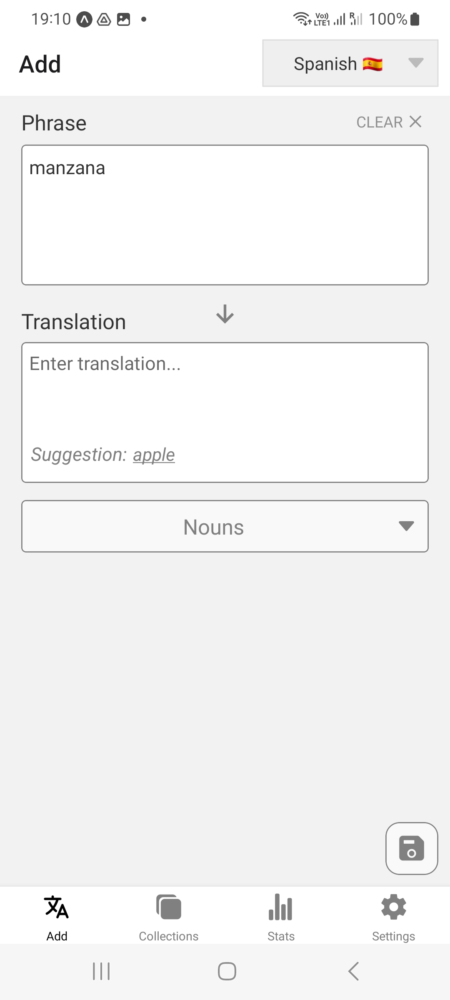
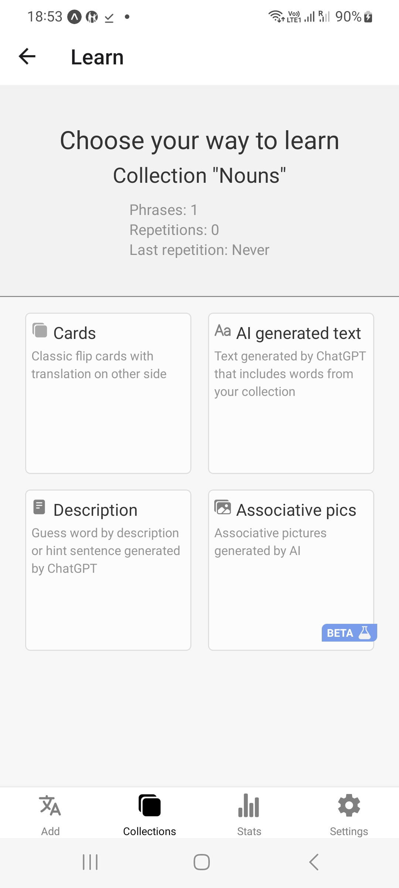
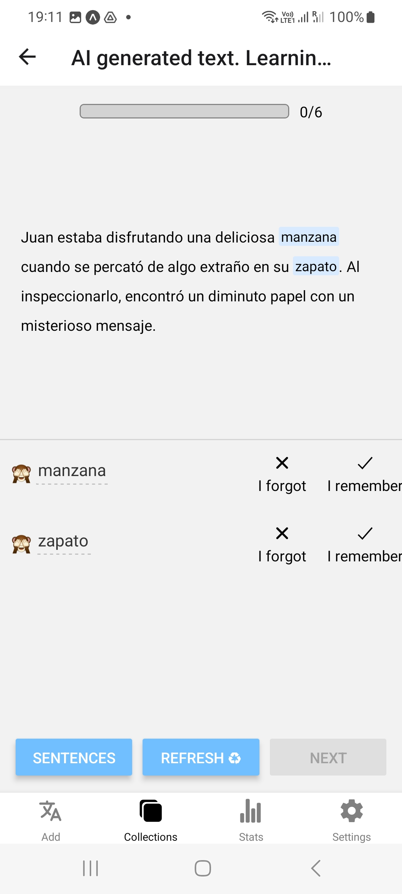
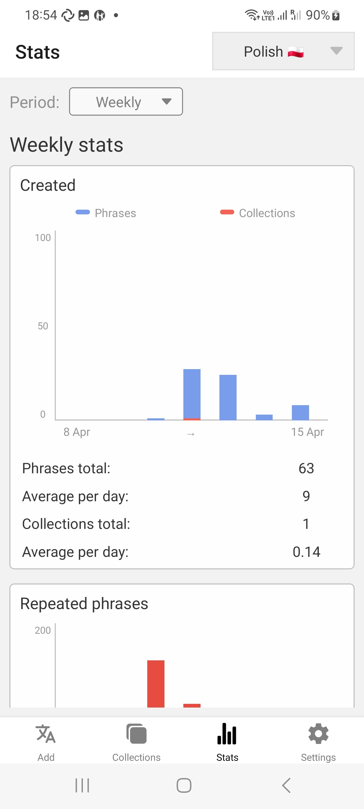

# Phraser
__Description:__ Mobile app for building vocabulary

__Used technologies:__

- Typescript
- React Native / Expo
- React Native navigation
- React hooks
- GraphQL / Apollo client
- MobX
- Moment
- Node.js / Express
- JWT auth
- Google OAuth
- Amazon SES (for account-related mails)
- MongoDB
- ChatGPT, DALL-E (openAI api)
- Bing translator api

 

__About project:__ Phraser - is an app for building vocabulary. It let you save and manage phrases in a convenient way, instead of writing them down on paper. 

It provides various ways to learn phrases you've saved:
- Classic flip cards 
- AI generated text for learning phrases in context
- AI generated description for consolidating your knowledge
- AI generated associative images (beta)
- 3 automatically generated collections (Hard to memorize, Interval collection and autogenerated mix)

 The app also provides different stats to let you easily review your progress.

 The app is account based, it provides you with all account-management functionality, you can log in on multiple devices (all data is synced), change or reset password anytime - everything you need to do is provide your email. You also can log in with google, so that you didn't have to keep in mind your account password
 
 The app is built via React Native/Expo. GraphQL is used for communicating with server, without sending excessive data. Inner state of the app is stored in MobX store and Apollo hooks. Backend part is written on Node.js and relies on different public apis (openAI api, bing translator api, amazon SES, google cloud e.t.c.). All permanent data is stored in MongoDB.

P.s. Being passionate language learner myself, I tried to make this app as useful as possible based on my own experience. It was made to help with overcoming the obstacles that I, and other language learners encounter during studies. Now, I use it myself and it helps me a lot :)

 

## Preview

	
	

	
	

